# Auth Series #1 - Azure Entra Id Authentication using ASP.NET Core MVC

This tutorial will be a series of Authentication/Authorization using Azure Entra Id (Azure AD).
Here are the details of the sample project used:
- Web Framework: ASP.NET Core 7x MVC
- Nuget: Microsoft.Identity.Web

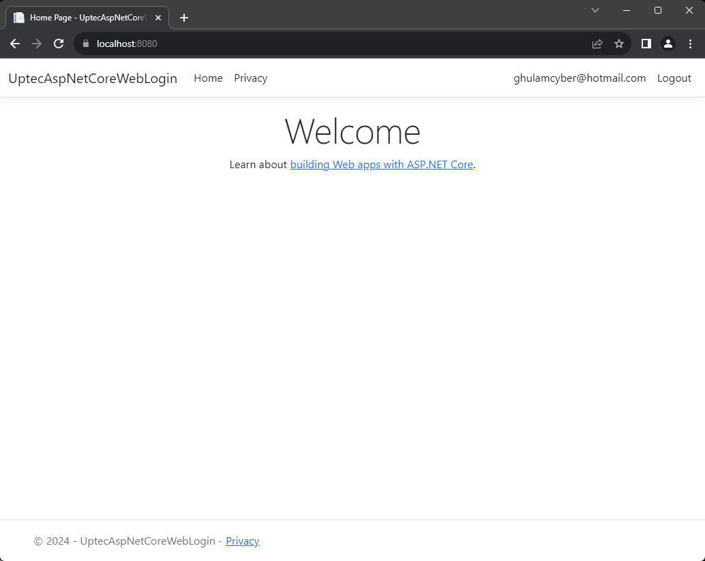

We are going to make simple ASP.NET Core MVC app (default template) that will 
have login and logout buttons/links to access protected page (Privacy page).
The login process will take you to Azure Entra Id for authentication using your local organization account.

Before we proceed, let's setup the things on the Azure Portal first.

### 1. Register the app

We need to create new app for our sample. You can follow the screenshots below to get to that page.

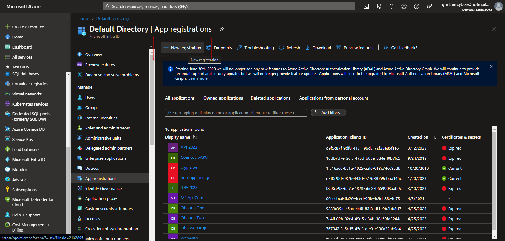

And after hitting New Registration button, you can fill the registration name with any name
you want and on the Redirect Uri, select Web option and enter the url: `https://localhost:8080/signin-oidc`. 
That url will be used by our app and /signin-oidc is a callback path to make sure
after the authentication process finished, Azure Entra Id will return back to the correct url.

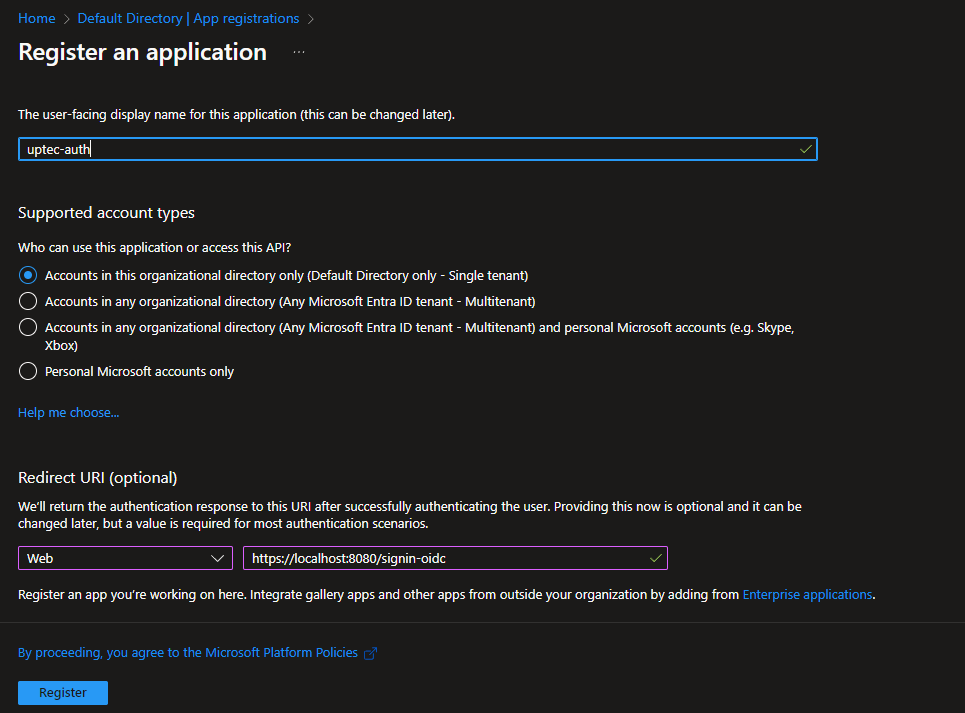

After registration been created, next step is to take a note for these important
informations from the Overview page.
- Client Id
- Tenant Id

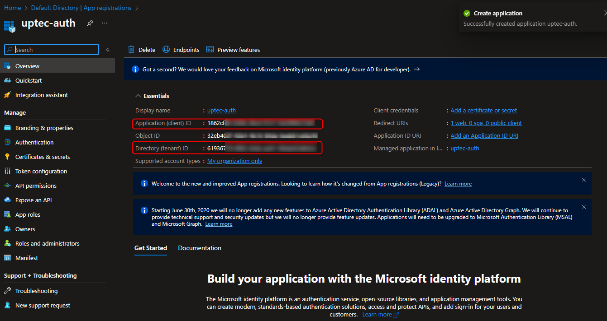

The next step is to create Client Secret (optional) for later use if we want to access API.
After the Client Secret been created, save the value of it.

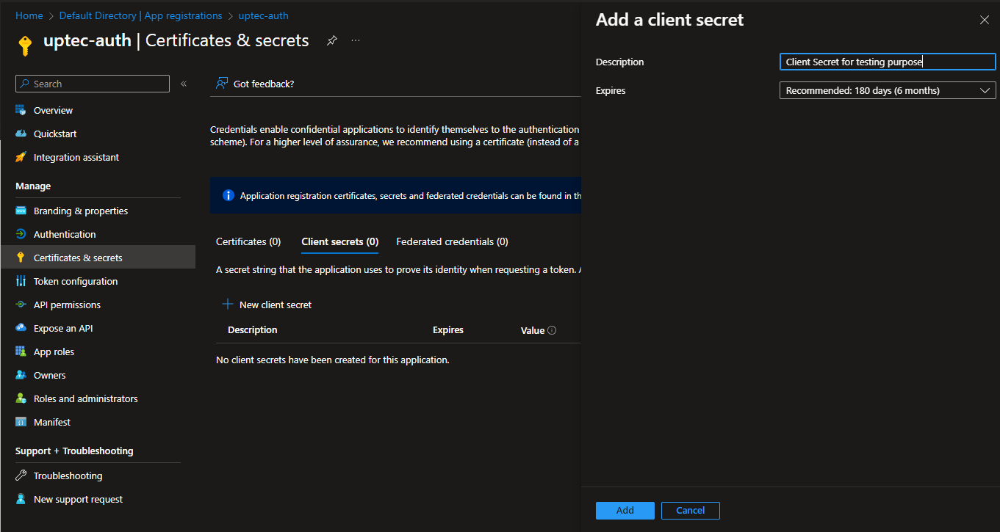
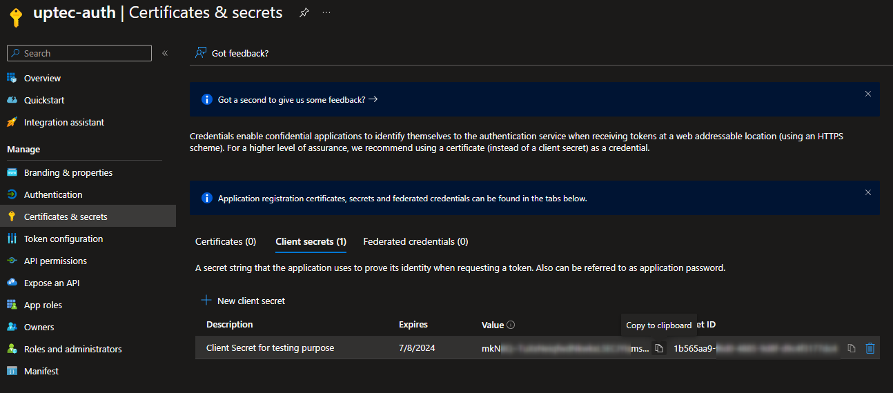

Our last step is to enable ID Tokens for authentication process. Go to the Authentication page,
and tick the ID Tokens.

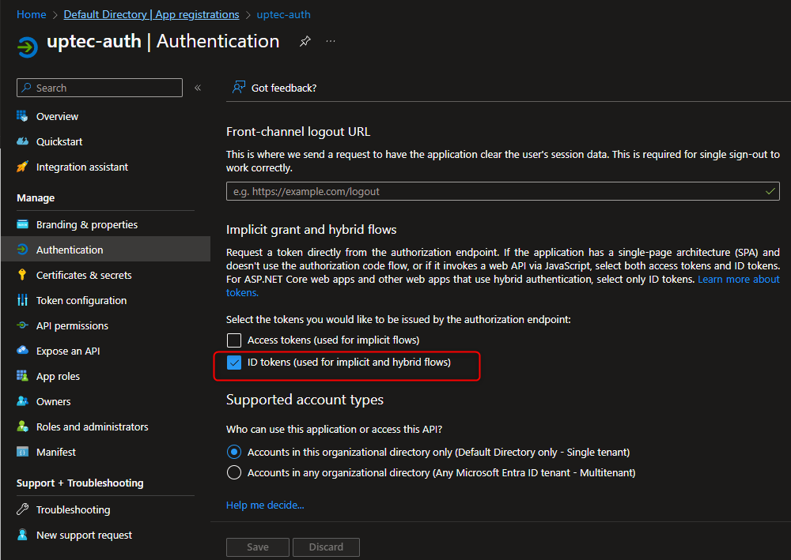

### 2. Initiate the ASP.NET Core MVC Project

Now, we need to create ASP.NET Core MVC Project. You can give any name for this sample project.

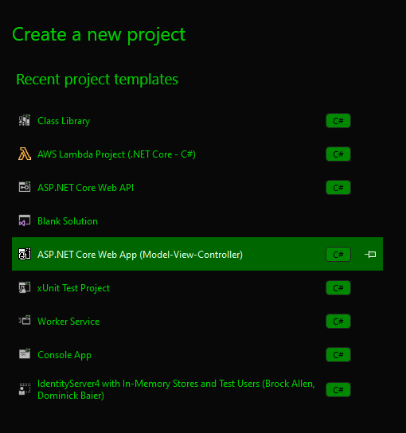
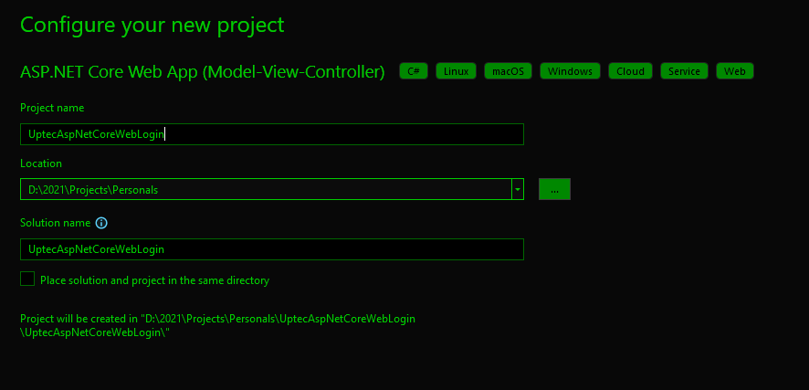

In the below section, make sure you select **None** for the Authentication type. 
The reason is, we'd like to setup everything manually.

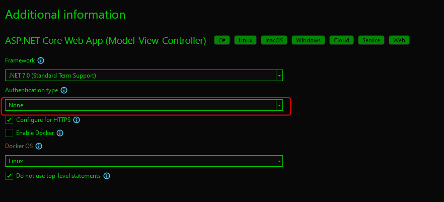

After project loaded. Now, we need to adjust the **launchSettings.json**.
Clean-up everything and just leave the https section like below:

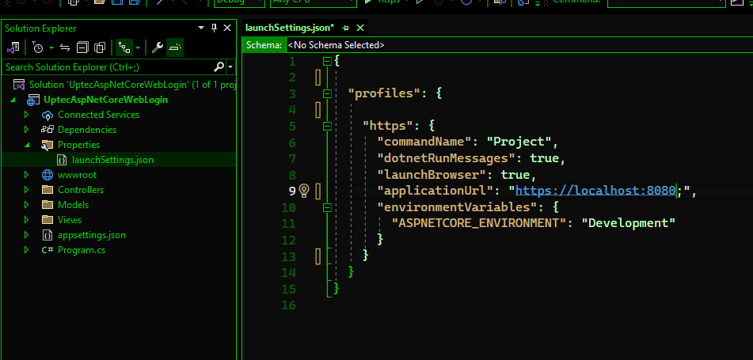

The next step is to install a nuget package that will handle everything for us.

`Microsoft.Identity.Web`

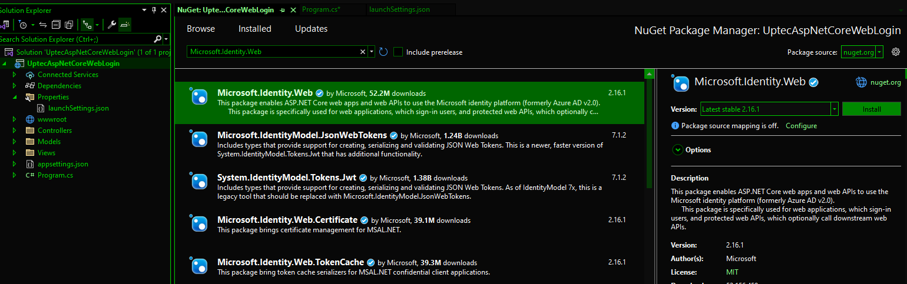

Once nuget package installed, we need to adjust our **appsettings.json** to hold
information like ClientId, TenantId etc. 
Make sure you replace the value with the ones you got when register the app in Azure Entra Id portal.

**NB**: In real world, you should put this on Azure KeyVault or something similiar or even encrypt it.

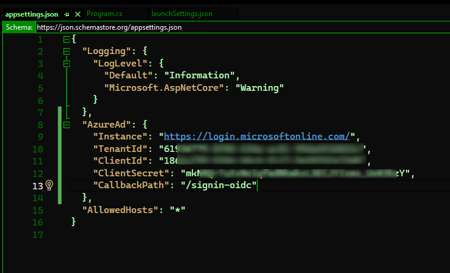

### 3. Adding authentication

Let's jump to **Program.cs** file. Here, we're gonna add the registration steps
to make sure OpenIdConnect authentication using Azure Entra Id works perfectly.
At first, make sure you include these following namespaces.

    using Microsoft.AspNetCore.Authentication.Cookies;
    using Microsoft.Identity.Web;

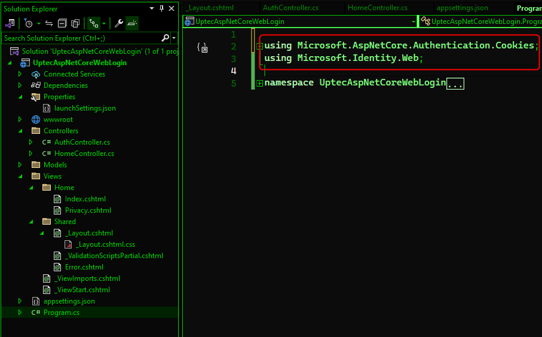

After that, we can add the OpenIdConnect authentication registration.  
Copy paste the following snippet:

    services.AddMicrosoftIdentityWebAppAuthentication(configuration, configSectionName: "AzureAd");
      

The code above will register the OpenIdConnect using Microsoft Identity Web library that
we have installed previously and will read the configuration section **"AzureAd"** that has
the information like ClientId, TenantId, etc (you can override the name or even the options).

Copy past the next snippet here:

    services.Configure<CookieAuthenticationOptions>(options =>
                {
                    options.LoginPath = new PathString("/Auth/Login");
                    options.LogoutPath = new PathString("/Auth/Logout");
                    options.ReturnUrlParameter = "redirectUrl";
                });

That code will re-configure the CookieAuthenticationOptions to setup
custom login/logout path and return url. We'll later create Controller for this.

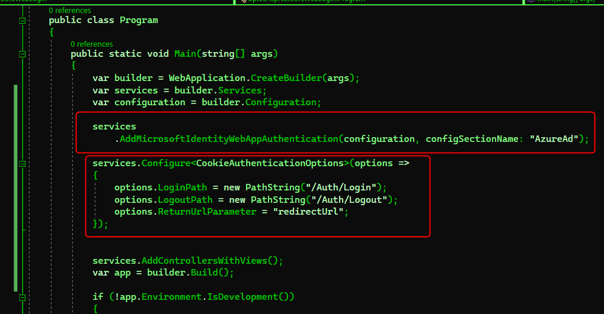

The last step, add the `app.UseAuthentication()` code right before
the `app.UseAuthorization()` to enable authentication.

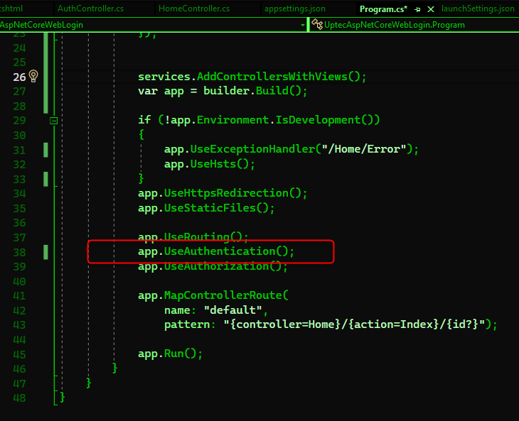

### 4. Adding AuthController to handle login/logout

Now, let's create new mvc controller and name it **AuthController**.

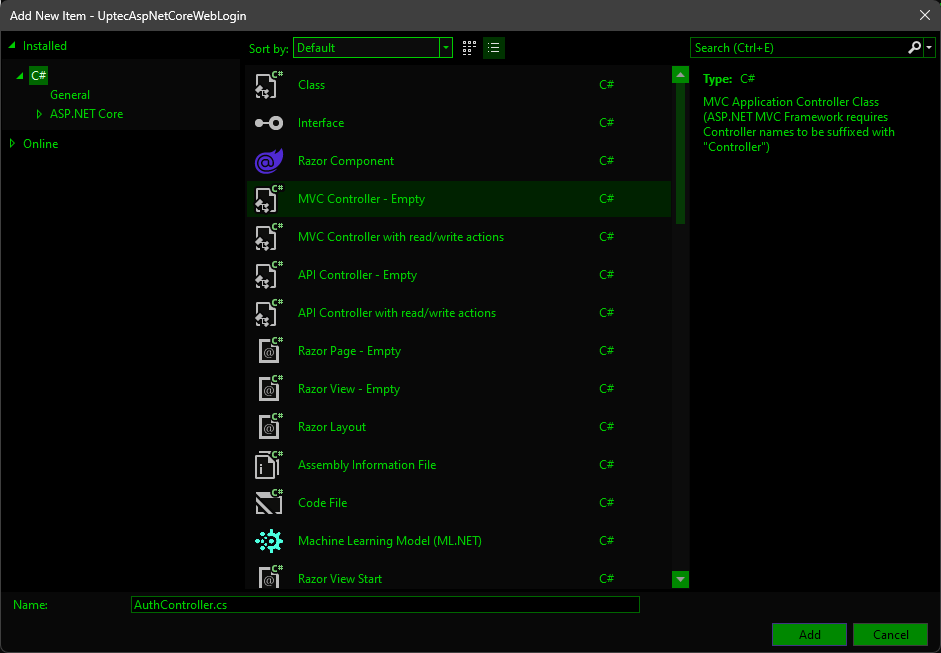

Inside the AuthController, we need to inject the **IConfiguration** instance and
add login method for that.

    public IActionResult Login(string redirectUrl = "/")
            {
                return Challenge(new AuthenticationProperties
                {
                    RedirectUri = Url.IsLocalUrl(redirectUrl) ?
                        redirectUrl : Url.Action("Index", "Home", null, Request.Scheme)
                },
                    OpenIdConnectDefaults.AuthenticationScheme);
            }

The code above will challenge the OpenIdConnect that we have registered.
We can also see the returnUrl/redirectUrl used to make sure after authentication finished,
the IDP will return us back to correct url.

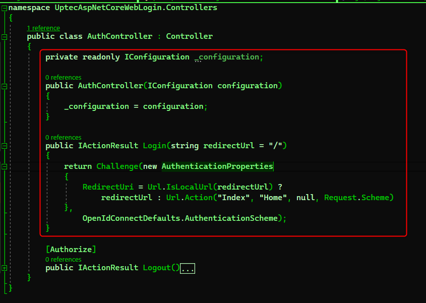

we need to create the logout method as well. This time, we need to mark it
as authorized, as this endpoint only available after authentication completed (non-anonymous).

        [Authorize]
        public IActionResult Logout()
        {
            return SignOut(
                OpenIdConnectDefaults.AuthenticationScheme,
                CookieAuthenticationDefaults.AuthenticationScheme);
        }

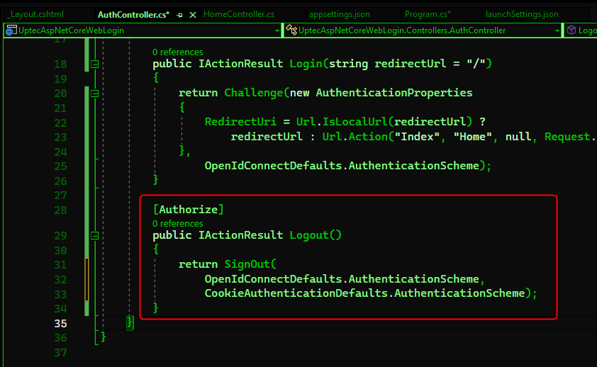

### 5. Adding sample authorized page

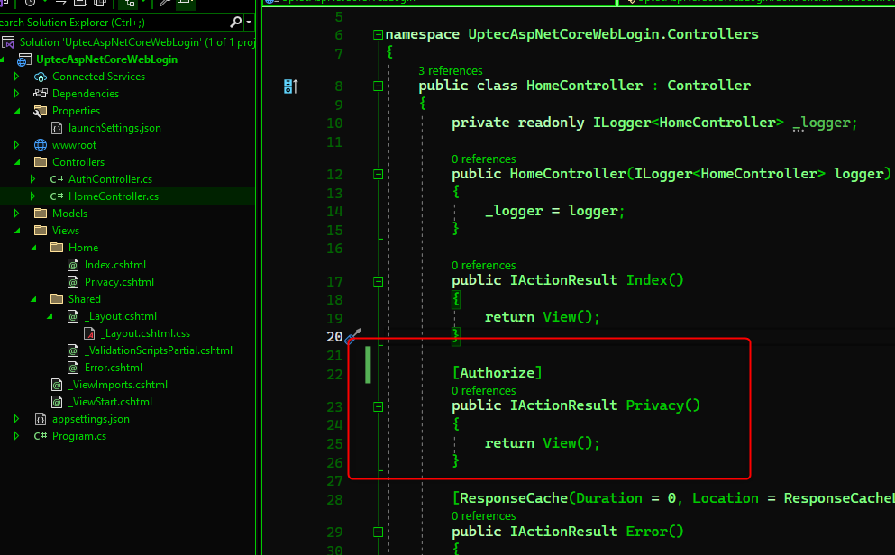

Go to HomeController, instead of creating new page/action, we can just
mark the default Privacy action/page with `[Authorized]` attribute.

### 6. Modify the _Layout.cshtml

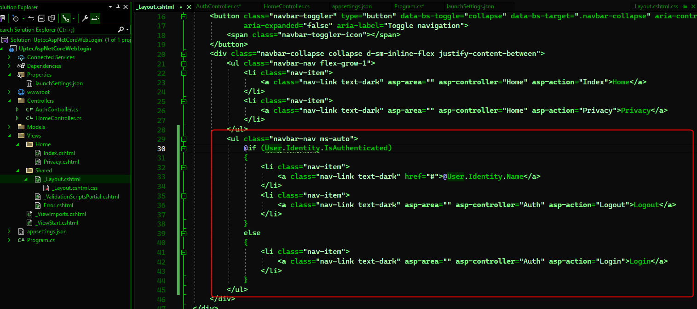

Add the following snippets like in the screenshot above so that we can have
login/logout link with authenticated username in the navbar section.

                    <ul class="navbar-nav ms-auto">
                        @if (User.Identity.IsAuthenticated)
                        {
                            <li class="nav-item">
                                <a class="nav-link text-dark" href="#">@User.Identity.Name</a>
                            </li>
                            <li class="nav-item">
                                <a class="nav-link text-dark" asp-area="" asp-controller="Auth" asp-action="Logout">Logout</a>
                            </li>
                        }
                        else
                        {
                            <li class="nav-item">
                                <a class="nav-link text-dark" asp-area="" asp-controller="Auth" asp-action="Login">Login</a>
                            </li>
                        }
                    </ul>

### 7. Testing out the app

Now, after everything is completed, we can test the app by clicking the login link or accessing the Privacy page.

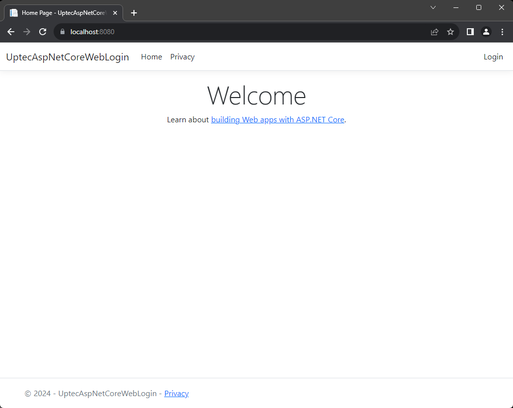

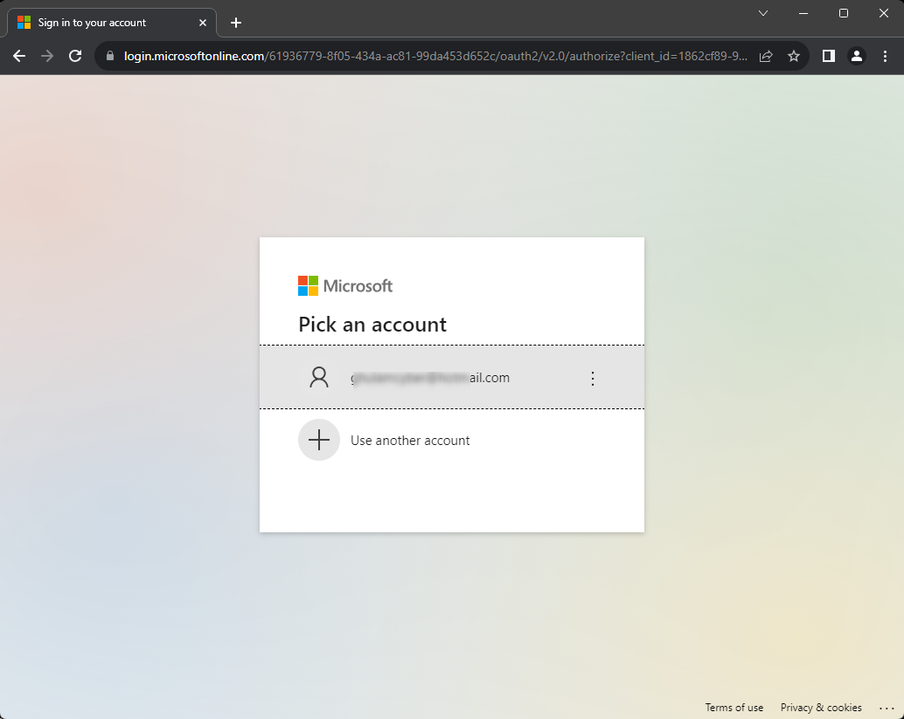

After we are successfully logged-in. We can access protected page.

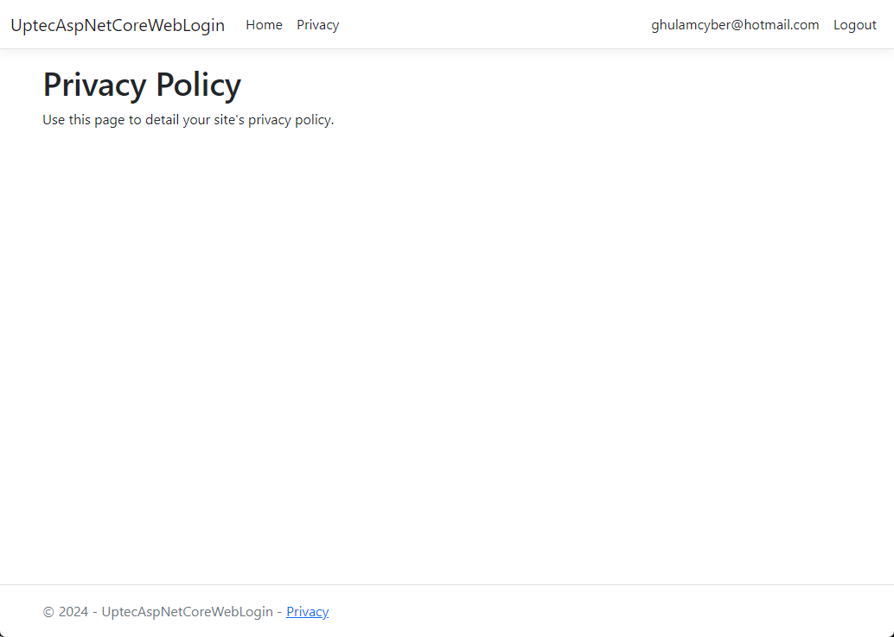

To logout from the app, click the logout link.

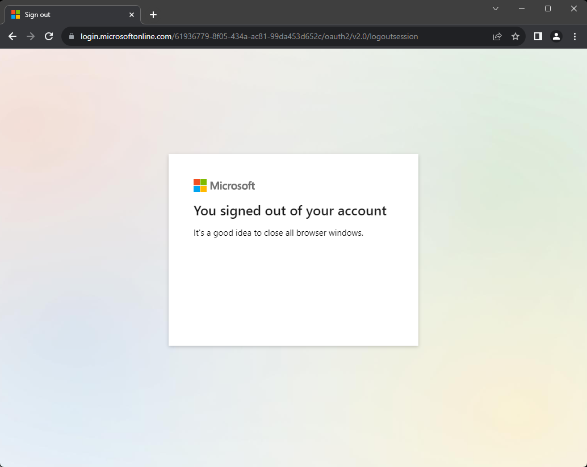

> Sample project: https://github.com/mirzaevolution/Uptec-Entra-Id-Web-Login